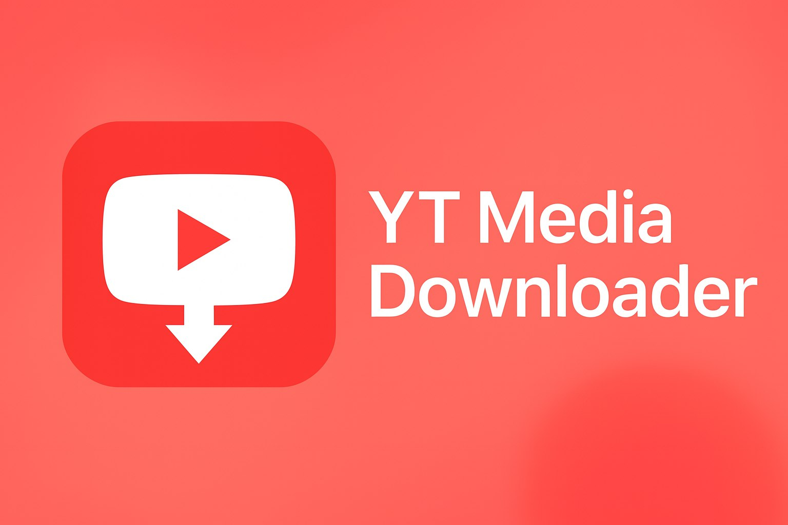

# YouTube Media Downloader

**Identidad del paquete:** `influent.yt-mediadownloader.v1.0-26.08-21.56`
**Autor:** `JesusQuijada34`
**Plataforma:** `AlphaCube`
**Descripción:** Estructura reparada por MoonFix

## Estructura PackageMaker 3.2.7

Este repositorio fue normalizado mediante **MoonFix**, usando la estructura de PackageMaker 3.2.7. El paquete público debe conservar `details.xml`, `version.res`, `autorun`, `autorun.bat`, `.storedetail`, `updater.py`, `config/settings.json`, los marcadores `.container` y los archivos de documentación correspondientes. El publisher oficial es `influent` y la versión pública no contiene sufijo de plataforma.

## Instalación y ejecución

Instala las dependencias declaradas en `lib/requirements.txt` cuando exista y ejecuta el entrypoint real del proyecto. En Linux, los comandos privilegiados son específicos de Danenone y no deben trasladarse a Windows. En proyectos AlphaCube, la validación Windows debe realizarse con el `buildthis` oficial de PackageMaker.

## Validación

La fuente debe pasar compilación sintáctica, pruebas funcionales disponibles, comprobación de identidad XML, protección contra traversal en ZIP y llamadas seguras a subprocess. Los artefactos `.iflapp` deben ser generados por PackageMaker; los paquetes Debian deben usar el nombre canónico `influent.yt-mediadownloader.v1.0-26.08-21.56_ARCH.deb`.

## Release

El tag y el título del release deben ser exactamente `v1.0-26.08-21.56`. Los assets deben usar el nombre canónico del paquete y una extensión objetiva. No se permite publicar un release AlphaCube que contenga únicamente el build Linux.

## Imágenes conservadas

## Referencia original

# 🎬 YT Media Downloader

¡Descarga videos y audios de **Youtube** y videos públicos de forma rápida y sencilla!
Disfruta de una interfaz moderna, oscura y amigable, con un navegador integrado para que no tengas que copiar y pegar enlaces.

---

##   ¿Qué es YT Media Downloader?

**YT Media Downloader** es una aplicación de escritorio multiplataforma (Windows, Linux, macOS) que te permite descargar tus reels y videos favoritos en formato **MP4** (video) o **MP3** (audio) con solo un clic.
Ideal para guardar contenido de Youtube de manera fácil y ordenada.

---

## ✨ Características principales

- 🖥️ **Navegador integrado:** Explora Youtube directamente desde la app.
- 🔗 **Detección automática de URL:** Captura la URL del video/reel que estás viendo sin copiar/pegar.
- 🎵 **Descarga de audio (MP3):** Extrae solo el audio de cualquier reel o video.
- 🎥 **Descarga de video (MP4):** Guarda el video completo en alta calidad.
- 📁 **Carpeta de descarga personalizada:** Elige dónde guardar tus archivos.
- 🌙 **Interfaz oscura y moderna:** Visualmente atractiva y cómoda para tus ojos.
- 🏷️ **Nombres automáticos:** Los archivos se guardan con el título original del video.
- 🌐 **Soporte para Shorts y videos públicos de Youtube.**
- 💻 **Compatible con Windows, Linux y macOS** (solo necesitas tener `ffmpeg` instalado para la conversión de audio).

---

## 🛠️ Requisitos

- Python 3.7 o superior
- [yt-dlp](https://github.com/yt-dlp/yt-dlp)
- PyQt5
- PyQtWebEngine
- ffmpeg (para extracción de audio, instálalo según tu sistema operativo)

### Instalación de dependencias
